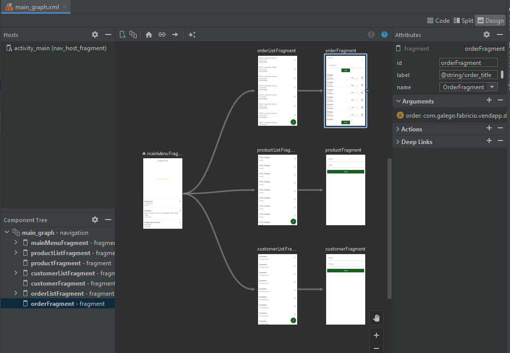
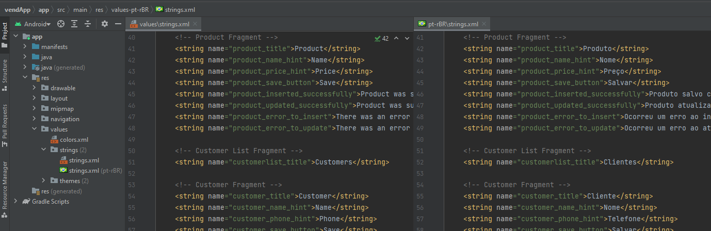

# VendApp

## About the Project 
This is an Android app developed using Kotlin with the aim of providing a functional application for me to practice and apply my knowledge. The app allows users to register products, customers, and orders, and visualize this data in graphs.

### Screenshots

### Architecture
By implementing clean architecture concepts, the data flow has been organized into the following layers:
- **UI:** responsible for displaying data to the user and handling user interactions. Activities and Fragments are located here.
- **ViewModels:** responsible for managing the app's business logic.
- **Repository:** responsible for managing and requesting access to data (in this case, locally stored data).
- **Data:** responsible for making requests to and receiving responses from the Room Database. This layer contains the Entities, DAOs, and the Room Database implementation.

### MVVM
The MVVM (Model-View-ViewModel) pattern was utilized to separate the app's business logic from its visual presentation. With MVVM, the user interface can remain responsive even during changes and loading of data in the business rules.
 
### LiveData
LiveData was implemented in the project due to its integration with the application lifecycle, its ability to be used safely in multiple threads, and its capability to update the user interface in response to data changes, regardless of the complexity of the business rules or the thread in which the changes were made.
  
### Room
The Room library was used to store data in a local database, which is recommended for improving efficiency, organization, and security during development. 
Foreign Keys were utilized in the room entities to ensure data integrity, optimize queries, and provide a clear modeling of relationships between entities.
 
### Navigation 
The Navigation library from Jetpack was utilized to structure the navigation between the screens of the app, making it easier to manage and maintain, and allowing for a complete view of the screen flow.

 
### Data Binding
Data Binding was used to manage the app's visual components, instead of FindViewById, as it provides greater security and ease of maintenance. This is because it verifies UI elements during compilation rather than only during execution, helping to prevent errors for the end user.

### Dependency Injection
The project was developed using dependency injection (DI) to create the app's architecture considering advantages such as code reuse, ease of refactoring and the intent of implementing unit tests.

#### Koin
A [branch](https://github.com/faGalego/vendApp/tree/koin) was created where dependency injection was implemented using Koin. I decided to implement Koin because it is a library that stands out for its simplicity of learning and implementation.

#### Hilt 
Another [branch](https://github.com/faGalego/vendApp/tree/hilt) for implementing DI using Hilt was also created. Later this branch was merged with the main branch. I decided to use Hilt because it is the DI library developed and recommended by Google, and also because it does the injection at compile time which optimizes the performance in the runtime.

### String resources and Internationalization
All application texts, including screen titles, error messages, buttons, and other elements, were stored in the strings.xml file. The file was originally created in English, with a translated version in Portuguese also being produced.

### Contact
If you have any suggestions or questions, feel free to contact me on [LinkedIn].

 [LinkedIn]: <https://www.linkedin.com/in/fabricio-schmidt-galego-41938651>
