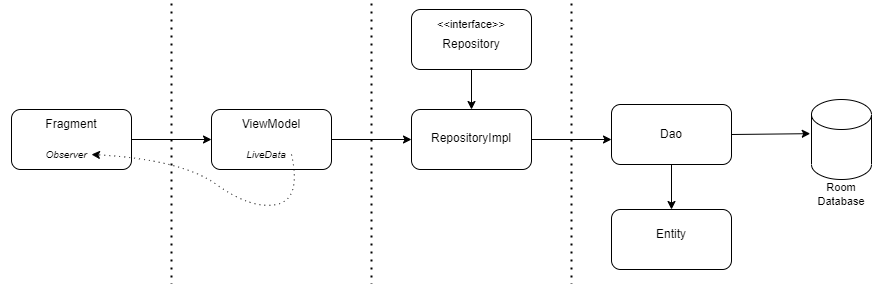

# VendApp

## About the Project 
This is an android app developed using Kotlin.
It was created with the aim of helping me to practice and apply my knowledge in a functional application.
The app allows users to register products, customers and orders, and visualize these data in graphs.

### Screenshots

### Architecture
By using clean architecture concepts, the data flow has been organized into the following layers:
- **UI:** responsible for displaying data to the user and handling user interactions. It is where are the Activities and Fragments.
- **ViewModels:** responsible for managing the application's business rules.
- **Repository:** responsible for managing and requesting access to data (in this case, stored locally).
- **Data:** responsible for making requests to and receiving responses from the Room Database. This is where the Entities, DAOs and the implementation of the Room Database are.

### MVVM
The MVVM (Model-View-ViewModel) pattern was used to separate the business logic from the visual presentation of the app. With MVVM the user interface can be enabled regardless of changes and loading of data in the business rules.
 
### LiveData
LiveData was used in the project due to its integration with the application lifecycle, the security of being used in multiple threads and the ability to update the user interface in response to data changes regardless of the complexity of the business rule or in which thread the change was made.
  
### Room
The Room library was used to store data in a local database, recommended for making development more efficient, organized and secure.
Foreing Keys were used in the room entities for data integrity, query optimization and clear modeling of relationships between entities.
 
### Navigation 
Jetpack's Navigation library was used to structure the navigation between the app’s screens, making it easier to manage and maintain, and keeping a complete view of the flow of the screens.
 
### Data Binding
 Data Binding was used instead of FindViewById to control the app's visual components, as it is more secure and easier to maintain because it checks for UI elements during compilation rather than just during execution, which helps to avoid errors for the end user.

### Contact
If you have any suggestions or questions, feel free to contact me on [LinkedIn].

 [LinkedIn]: <https://www.linkedin.com/in/fabricio-schmidt-galego-41938651>
